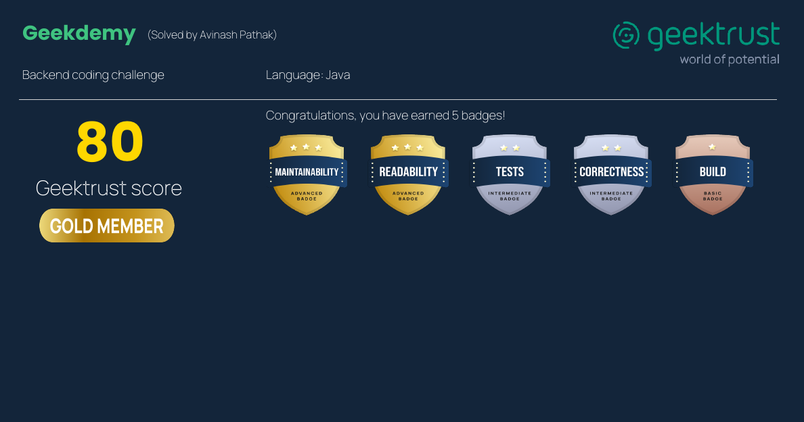

# Geekdemy: Project Setup & Execution Guide



## Prerequisites

Make sure the following are installed:

* **Java 8 (1.8)**
* **Maven**

---

## How to Run the Application

This project includes scripts to build and run the application easily.

### Step 1: Use the appropriate script

* **Linux / macOS / Unix** → `run.sh`
* **Windows** → `run.bat`

These scripts:

* Build the project silently
* Execute the application
* Display output generated from the input file
  (`sample_input/input1.txt`)

> Add input commands to the file as per the problem statement before execution.

---

### What happens behind the scenes

The scripts internally run the following commands:

1. **Build the project**

   ```bash
   mvn clean install -DskipTests assembly:single -q
   ```

   This creates the executable JAR:

   ```
   target/geektrust.jar
   ```

2. **Run the application**

   ```bash
   java -jar target/geektrust.jar sample_input/input1.txt
   ```

---

## Input & Output Contract

* The application accepts the **input file path** as a command-line argument.
* Input is read from a **text file only**.
* Output is printed to the **console**.
* The input file contains commands strictly in the format defined by the problem statement.

---

## Maven Configuration

Use the provided `pom.xml`.

If your main class has changed, update this entry:

```xml
<mainClass>com.example.geektrust.Main</mainClass>
```

---

## Running Multiple Test Cases

1. Add commands to:

   * `sample_input/input1.txt`
   * `sample_input/input2.txt`

2. Update the execution command in `run.sh` or `run.bat`:

   ```bash
   java -jar target/geektrust.jar sample_input/input2.txt
   ```

---

## Running Unit Tests

Execute all unit tests using:

```bash
mvn clean test
```

---

## About the Developer

**Avinash Pathak**
Aspriring Java Backend Developer (Career Switcher)

* Strong foundation in **Core Java, OOPs, Collections, Exception Handling**
* Hands-on experience with **Spring Boot, REST APIs, Maven**
* Focused on writing **clean, modular, and testable code**
* Background of **6+ years at Amazon (Operations & Escalation Handling)**, and 1+ year of Java Development training from **Crio.Do** bringing strong ownership, problem-solving, and production mindset into software development

📧 **Email:** *avinashee0012@gmail.com*
💼 **LinkedIn:** *https://www.linkedin.com/in/avinashee0012/*
🐙 **GitHub:** *https://github.com/avinashee0012*

> Actively seeking **Java Backend Developer / Software Engineer (Fresher / Entry-Level)** opportunities.
